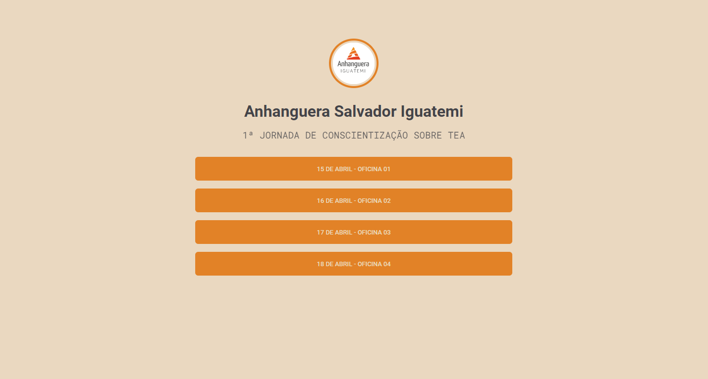

<h1 align="center"">
  
  Anhaguera Salvador Iguatemi
</h1>

  <a href="#project">Projeto</a>&nbsp;&nbsp;&nbsp;|&nbsp;&nbsp;&nbsp;
  <a href="#technologies">Tecnologias</a>&nbsp;&nbsp;&nbsp;|&nbsp;&nbsp;&nbsp;
  <a href="#license">Licença</a>

  

<h2 id="project">📁 Projeto</h2>

O Anhanguera Salvador Iguatemi é um solução para juntar todos os links das palestras que criamos de forma que facilite o acesso dos alunos aos eventos que acontecem na faculdade e em breve serão implementadas mais soluções.

<h2 id="technologies">💻 Tecnologias</h2>

Este projeto foi desenvolvido com as seguintes tecnologias:

- ReactJS
- Styled Components
- TypeScript
- ViteJS

<h2 id="license">📝 Licença</h2>

Este projeto está sob a licença MIT.

  
  
  

